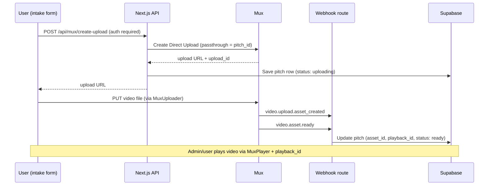

# Mux Integration Guide for 10KP

A step-by-step guide to integrate [Mux](https://www.mux.com) into the 10KP pitch submission platform so **video submissions** are uploaded, transcoded, and streamed by Mux instead of Supabase Storage.

Non-video files (PDF, documents, images, audio) continue to use the existing Supabase Storage flow.

---

## Table of Contents

1. [Why Mux for This Project](#why-mux-for-this-project)
2. [How Mux Works (Overview)](#how-mux-works-overview)
3. [Phase 1 — Create and Configure a Mux Account](#phase-1--create-and-configure-a-mux-account)
4. [Phase 2 — Local Development Setup](#phase-2--local-development-setup)
5. [Phase 3 — Database Schema Changes](#phase-3--database-schema-changes)
6. [Phase 4 — Backend API Routes](#phase-4--backend-api-routes)
7. [Phase 5 — Webhook Handler](#phase-5--webhook-handler)
8. [Phase 6 — Update the Intake Form](#phase-6--update-the-intake-form)
9. [Phase 7 — Admin Playback](#phase-7--admin-playback)
10. [Phase 8 — Deploy to Vercel](#phase-8--deploy-to-vercel)
11. [Phase 9 — Testing Checklist](#phase-9--testing-checklist)
12. [Architecture Diagram](#architecture-diagram)
13. [File Change Summary](#file-change-summary)
14. [Troubleshooting](#troubleshooting)
15. [References](#references)

---

## Why Mux for This Project

Today, `app/intake/page.jsx` uploads **all** file types — including video — directly to the Supabase `pitch-files` bucket. That works for storage, but it does not:

- Transcode videos into adaptive HLS streams
- Generate thumbnails or storyboards
- Handle large/resumable uploads reliably
- Provide a production-grade video player with analytics

Mux solves these problems. Videos go **browser → Mux** (direct upload), Mux processes them, and your app stores metadata (`asset_id`, `playback_id`, status) in Supabase.

| File type | Current handler | After Mux integration |
|-----------|----------------|----------------------|
| Video (`.mp4`, `.mov`, `.webm`) | Supabase Storage | **Mux Direct Upload** |
| PDF, docs, images, audio | Supabase Storage | Supabase Storage (unchanged) |

---

## How Mux Works (Overview)



### Key Mux concepts

| Concept | Description |
|---------|-------------|
| **Direct Upload** | A one-time signed URL. The browser uploads the file directly to Mux — your server never handles the binary. |
| **Asset** | The processed video Mux creates after upload completes. |
| **Playback ID** | Used by `MuxPlayer` or HLS URLs to stream the video. |
| **Passthrough** | A string you attach when creating the upload. Mux echoes it back in webhooks — use your `pitch.id` to link events to database rows. |
| **Webhooks** | Mux POSTs events (`video.asset.ready`, etc.) to your server when processing state changes. |

### Important webhook events

| Event | When it fires | What to do |
|-------|---------------|------------|
| `video.upload.asset_created` | Upload finished, asset created | Set `mux_asset_id`, status → `processing` |
| `video.asset.ready` | Transcoding complete | Set `mux_playback_id`, status → `ready` |
| `video.asset.errored` | Processing failed | Set status → `errored`, log error |
| `video.upload.errored` | User uploaded non-video file | Set status → `errored` |

---

## Phase 1 — Create and Configure a Mux Account

### Step 1.1 — Sign up

1. Go to [https://dashboard.mux.com/signup](https://dashboard.mux.com/signup)
2. Create an account (no credit card required for development; free tier covers testing)
3. You land in the **Production** environment by default — use this for Vercel deploys. Create a **Development** environment later if you want separate credentials for local work.

### Step 1.2 — Create an API access token

1. Dashboard → **Settings** → **Access Tokens**
2. Click **Generate new token**
3. Configure:
   - **Environment:** Production (or Development for local-only)
   - **Permissions:** Mux Video — **Read** and **Write**
   - **Name:** e.g. `10kp-nextjs`
4. Click **Generate token**
5. Copy and save immediately:
   - **Token ID** → `MUX_TOKEN_ID`
   - **Token Secret** → `MUX_TOKEN_SECRET` (shown only once)

> Never expose these in client-side code. They are server-only.

### Step 1.3 — Playback policy choice

This setup uses **public playback** so processed videos can play without signed tokens.
No signing key is required.

### Step 1.4 — Configure webhooks (do this after Phase 5 is deployed)

For now, note the URL you will use:

| Environment | Webhook URL |
|-------------|-------------|
| Local (via Mux CLI) | `http://localhost:3000/api/webhooks/mux` |
| Production (Vercel) | `https://your-app.vercel.app/api/webhooks/mux` |

You will register this in **Settings → Webhooks** after the route exists.

### Step 1.5 — Install Mux CLI (optional, for local webhook testing)

```bash
# macOS
brew install muxinc/mux/mux

# Or via npm
npm install -g @mux/cli
```

Login and forward webhooks during local dev:

```bash
mux login
mux webhooks serve --forward-to http://localhost:3000/api/webhooks/mux
```

---

## Phase 2 — Local Development Setup

### Step 2.1 — Install npm packages

```bash
npm install @mux/mux-node @mux/mux-uploader-react @mux/mux-player-react
```

| Package | Purpose |
|---------|---------|
| `@mux/mux-node` | Server SDK — create uploads and verify webhooks |
| `@mux/mux-uploader-react` | Drop-in upload UI with progress, retries, chunking |
| `@mux/mux-player-react` | HLS video player for admin review (and future gallery) |

### Step 2.2 — Add environment variables

Add to `.env.local` (and later to Vercel project settings):

```bash
# Mux API credentials (server-only)
MUX_TOKEN_ID=your-token-id
MUX_TOKEN_SECRET=your-token-secret

# Mux webhook verification (server-only)
MUX_WEBHOOK_SECRET=your-webhook-signing-secret

# Already in project — used for CORS on direct uploads
NEXT_PUBLIC_SITE_URL=http://localhost:3000
```

Update `.env.example` with placeholder entries (no real secrets).

### Step 2.3 — Create a Mux server client

Create `lib/mux.js`:

```javascript
import Mux from "@mux/mux-node";

export const mux = new Mux({
  tokenId: process.env.MUX_TOKEN_ID,
  tokenSecret: process.env.MUX_TOKEN_SECRET,
  webhookSecret: process.env.MUX_WEBHOOK_SECRET,
});
```

This mirrors the pattern in `lib/supabase.js` (browser client + server admin client).

---

## Phase 3 — Database Schema Changes

Run this in the Supabase SQL Editor. It extends `pitches` to track Mux state without breaking existing non-video submissions.

```sql
-- Add Mux-related columns to pitches
alter table public.pitches
  add column if not exists file_type text default 'file',  -- 'file' | 'video'
  add column if not exists mux_upload_id text,
  add column if not exists mux_asset_id text,
  add column if not exists mux_playback_id text,
  add column if not exists mux_status text default 'pending';
  -- mux_status values: pending | uploading | processing | ready | errored

-- Optional: index for admin queries on video status
create index if not exists pitches_mux_status_idx on public.pitches (mux_status);
```

### Column usage

| Column | Set by | Purpose |
|--------|--------|---------|
| `file_type` | Intake form on submit | `'video'` or `'file'` — determines playback path |
| `mux_upload_id` | Create-upload API | Links to Mux Direct Upload |
| `mux_asset_id` | Webhook `video.upload.asset_created` | Mux asset reference |
| `mux_playback_id` | Webhook `video.asset.ready` | Used by MuxPlayer |
| `mux_status` | API + webhooks | UI processing indicator |
| `file_path` / `file_name` | Unchanged | Still used for non-video Supabase files |

---

## Phase 4 — Backend API Routes

### Step 4.1 — Create upload URL (authenticated)

**File:** `app/api/mux/create-upload/route.js`

This route must:
1. Verify the user is logged in (same pattern as `lib/adminAuth.js`, but for any authenticated user)
2. Accept `{ pitchId }` in the body (pitch row created first in intake form)
3. Call Mux to create a Direct Upload with `passthrough: pitchId`
4. Return `{ uploadUrl, uploadId }`

```javascript
import { NextResponse } from "next/server";
import { createClient } from "@supabase/supabase-js";
import { mux } from "../../../../lib/mux";

async function verifyUser(request) {
  const authHeader = request.headers.get("authorization");
  if (!authHeader?.startsWith("Bearer ")) {
    return { error: "Missing authorization header", status: 401 };
  }
  const token = authHeader.replace("Bearer ", "");
  const supabase = createClient(
    process.env.NEXT_PUBLIC_SUPABASE_URL,
    process.env.NEXT_PUBLIC_SUPABASE_ANON_KEY,
    { global: { headers: { Authorization: `Bearer ${token}` } } }
  );
  const { data: { user }, error } = await supabase.auth.getUser();
  if (error || !user) return { error: "Unauthorized", status: 401 };
  return { user, supabase };
}

export async function POST(request) {
  const auth = await verifyUser(request);
  if (auth.error) {
    return NextResponse.json({ error: auth.error }, { status: auth.status });
  }

  const { pitchId } = await request.json();
  if (!pitchId) {
    return NextResponse.json({ error: "pitchId is required" }, { status: 400 });
  }

  // Verify pitch belongs to this user
  const { data: pitch } = await auth.supabase
    .from("pitches")
    .select("id")
    .eq("id", pitchId)
    .eq("user_id", auth.user.id)
    .single();

  if (!pitch) {
    return NextResponse.json({ error: "Pitch not found" }, { status: 404 });
  }

  const siteUrl =
    process.env.NEXT_PUBLIC_SITE_URL ||
    (process.env.NEXT_PUBLIC_VERCEL_URL
      ? `https://${process.env.NEXT_PUBLIC_VERCEL_URL}`
      : "http://localhost:3000");

  const upload = await mux.video.uploads.create({
    cors_origin: siteUrl,
    new_asset_settings: {
      passthrough: pitchId,
      playback_policy: ["public"],
      video_quality: "basic",
    },
  });

  // Track upload ID on the pitch
  await auth.supabase
    .from("pitches")
    .update({ mux_upload_id: upload.id, mux_status: "uploading" })
    .eq("id", pitchId);

  return NextResponse.json({ uploadUrl: upload.url, uploadId: upload.id });
}
```

### Step 4.2 — Public playback

Because playback is public, you do not need a token-signing route.
Render `MuxPlayer` directly with `playbackId`.

---

## Phase 5 — Webhook Handler

**File:** `app/api/webhooks/mux/route.js`

> **Critical:** Use `request.text()` for the raw body, not `request.json()`. Mux signature verification requires the unparsed body.

```javascript
import { NextResponse } from "next/server";
import { mux } from "../../../../lib/mux";
import { getSupabaseAdmin } from "../../../../lib/supabase";

export async function POST(request) {
  const rawBody = await request.text();
  const headers = Object.fromEntries(request.headers);

  let event;
  try {
    event = mux.webhooks.unwrap(rawBody, headers);
  } catch {
    return NextResponse.json({ error: "Invalid signature" }, { status: 400 });
  }

  const supabaseAdmin = getSupabaseAdmin();
  const pitchId = event.data?.passthrough;

  if (!pitchId) {
    return NextResponse.json({ message: "ok" });
  }

  switch (event.type) {
    case "video.upload.asset_created":
      await supabaseAdmin
        .from("pitches")
        .update({
          mux_asset_id: event.data.asset_id,
          mux_status: "processing",
        })
        .eq("id", pitchId);
      break;

    case "video.asset.ready":
      await supabaseAdmin
        .from("pitches")
        .update({
          mux_asset_id: event.data.id,
          mux_playback_id: event.data.playback_ids?.[0]?.id,
          mux_status: "ready",
        })
        .eq("id", pitchId);
      break;

    case "video.asset.errored":
    case "video.upload.errored":
      await supabaseAdmin
        .from("pitches")
        .update({ mux_status: "errored" })
        .eq("id", pitchId);
      break;
  }

  return NextResponse.json({ message: "ok" });
}
```

### Register the webhook in Mux Dashboard

1. **Settings → Webhooks → Create webhook**
2. **URL:** your deployed `/api/webhooks/mux` endpoint
3. Copy the **Signing Secret** → `MUX_WEBHOOK_SECRET` in Vercel
4. Enable events: `video.upload.asset_created`, `video.asset.ready`, `video.asset.errored`, `video.upload.errored`

### Local testing without deploying

```bash
# Terminal 1
npm run dev

# Terminal 2
mux webhooks serve --forward-to http://localhost:3000/api/webhooks/mux
```

---

## Phase 6 — Update the Intake Form

**File:** `app/intake/page.jsx`

The intake form needs a **branching submit flow** based on file type.

### Step 6.1 — Detect video vs non-video

```javascript
const VIDEO_TYPES = ["video/mp4", "video/quicktime", "video/webm"];

function isVideoFile(file) {
  return file && VIDEO_TYPES.includes(file.type);
}
```

### Step 6.2 — New video submission flow

Replace the current single-path upload with:

```
1. Validate form fields
2. INSERT pitch row (file_type: 'video', mux_status: 'pending')
3. POST /api/mux/create-upload { pitchId }  → get uploadUrl
4. Upload file via MuxUploader (or UpChunk) to uploadUrl
5. On upload success → show "Video submitted — processing may take a few minutes"
6. Webhooks update mux_status to 'ready' asynchronously
```

### Step 6.3 — Add MuxUploader for video files

When the user selects a video file, show `MuxUploader` instead of (or alongside) the native file input:

```jsx
import MuxUploader from "@mux/mux-uploader-react";

// Inside the form, conditionally:
{isVideoFile(file) ? (
  <MuxUploader
    endpoint={async () => {
      // Called when user starts upload — pitch must already exist
      const token = (await supabase.auth.getSession()).data.session?.access_token;
      const res = await fetch("/api/mux/create-upload", {
        method: "POST",
        headers: {
          "Content-Type": "application/json",
          Authorization: `Bearer ${token}`,
        },
        body: JSON.stringify({ pitchId }),
      });
      const { uploadUrl } = await res.json();
      return uploadUrl;
    }}
    onSuccess={() => setSuccess(true)}
  />
) : (
  /* existing file input for non-video */
)}
```

### Step 6.4 — Restructure `handleSubmit`

Recommended order for **video** submissions:

| Step | Action |
|------|--------|
| 1 | Validate fields |
| 2 | `INSERT` pitch with `file_type: 'video'`, `file_name: file.name` |
| 3 | `INSERT` pitch_tags |
| 4 | Store `pitchId` in state |
| 5 | Trigger MuxUploader (user confirms upload) |
| 6 | On success, reset form |

For **non-video**, keep the existing flow unchanged (Supabase Storage upload).

### Step 6.5 — UX: processing state

After upload completes, Mux still needs time to transcode. Show:

> "Your pitch was submitted. Video processing may take a few minutes."

Optionally poll the pitch row for `mux_status === 'ready'` if you want a live status indicator.

---

## Phase 7 — Admin Playback

**File:** `app/admin/page.jsx`

Update the pitches table to handle video rows differently.

### Step 7.1 — Extend admin API response

**File:** `app/api/admin/pitches/route.js`

Add Mux fields to the SELECT:

```javascript
.select(`
  id, name, title, description, file_name, file_type,
  mux_playback_id, mux_status, created_at,
  pitch_tags ( tags ( id, name ) )
`)
```

### Step 7.2 — Play video in expanded row

When `file_type === 'video'` and `mux_status === 'ready'`:

```jsx
import MuxPlayer from "@mux/mux-player-react";

// Fetch signed token, then:
<MuxPlayer
  playbackId={pitch.mux_playback_id}
  tokens={{ playback: playbackToken }}
/>
```

When `mux_status === 'processing'`:

```jsx
<p className="text-sm text-gray-500">Video is still processing…</p>
```

When `file_type === 'file'`:

Keep existing behavior (link to Supabase file or filename display).

---

## Phase 8 — Deploy to Vercel

### Step 8.1 — Add env vars in Vercel

Project → **Settings → Environment Variables**. Add all Mux vars from Phase 2.2 for Production and Preview.

### Step 8.2 — Set `NEXT_PUBLIC_SITE_URL`

Set to your production domain, e.g. `https://10kp.vercel.app`. Mux uses `cors_origin` to allow browser uploads from your domain.

### Step 8.3 — Register production webhook

1. Deploy the branch with the webhook route
2. Mux Dashboard → **Settings → Webhooks**
3. URL: `https://your-domain.vercel.app/api/webhooks/mux`
4. Copy signing secret → Vercel env `MUX_WEBHOOK_SECRET`
5. Redeploy so the new secret is available

### Step 8.4 — Supabase RLS note

Webhook updates use `getSupabaseAdmin()` (service role), so they bypass RLS. No policy changes needed for webhook writes.

---

## Phase 9 — Testing Checklist

### Account & credentials
- [ ] Mux access token created with Video Read/Write
- [ ] Uploads are created with `playback_policy: ["public"]`
- [ ] All env vars set locally and on Vercel

### Upload flow
- [ ] Log in as a regular `@umich.edu` user
- [ ] Submit a pitch with a `.mp4` file
- [ ] Pitch row created with `file_type: 'video'`
- [ ] MuxUploader shows progress and completes
- [ ] `mux_upload_id` saved on pitch row

### Webhook flow
- [ ] `video.upload.asset_created` → `mux_status: processing`
- [ ] `video.asset.ready` → `mux_playback_id` populated, `mux_status: ready`
- [ ] Webhook signature verification rejects invalid requests

### Non-video unchanged
- [ ] PDF upload still goes to Supabase Storage
- [ ] `file_path` and `file_name` populated as before

### Admin
- [ ] Admin sees video pitches in table
- [ ] Processing pitches show status badge
- [ ] Ready videos play in expanded row via MuxPlayer

### Error cases
- [ ] Upload non-video file to Mux path → `video.upload.errored` handled
- [ ] Unauthenticated call to `/api/mux/create-upload` → 401
- [ ] User tries to upload to another user's pitch → 404

---

## Architecture Diagram

### Current flow (all files)

```
intake/page.jsx
    → INSERT pitches
    → supabase.storage.upload (pitch-files bucket)
    → UPDATE pitches (file_path, file_name)
    → INSERT pitch_tags
```

### Target flow (after Mux)

```
intake/page.jsx
    │
    ├─ video file ──────────────────────────────────────────────┐
    │    → INSERT pitches (file_type: video)                      │
    │    → POST /api/mux/create-upload                            │
    │    → MuxUploader → Mux cloud                                │
    │    → webhook → UPDATE pitches (mux_playback_id, ready)      │
    │                                                             │
    └─ other files ─────────────────────────────────────────────┤
         → INSERT pitches (file_type: file)                       │
         → supabase.storage.upload                                │
         → UPDATE pitches (file_path, file_name)                  │
         → INSERT pitch_tags ◄───────────────────────────────────┘
```

---

## File Change Summary

| File | Action |
|------|--------|
| `package.json` | Add `@mux/mux-node`, `@mux/mux-uploader-react`, `@mux/mux-player-react` |
| `.env.example` | Add Mux env var placeholders |
| `lib/mux.js` | **New** — Mux server client |
| `lib/muxAuth.js` | **New** (optional) — `verifyUser()` helper shared by Mux routes |
| `app/api/mux/create-upload/route.js` | **New** — create Direct Upload URL |
| `app/api/webhooks/mux/route.js` | **New** — handle Mux webhook events |
| `app/intake/page.jsx` | **Modify** — branch video vs non-video upload |
| `app/api/admin/pitches/route.js` | **Modify** — return Mux fields |
| `app/admin/page.jsx` | **Modify** — MuxPlayer for video pitches |
| `supabase-setup.sql` | **Modify** — add Mux columns (or separate migration file) |

---

## Troubleshooting

| Problem | Likely cause | Fix |
|---------|--------------|-----|
| CORS error on upload | `cors_origin` mismatch | Set `NEXT_PUBLIC_SITE_URL` to exact origin (no trailing slash) |
| Webhook never fires locally | Mux can't reach localhost | Use `mux webhooks serve --forward-to ...` |
| `Invalid signature` on webhook | Parsed body instead of raw | Use `request.text()` + `mux.webhooks.unwrap()` |
| Video stuck on `processing` | Webhook not registered or wrong URL | Check Mux Dashboard webhook logs |
| Player shows error | Missing/invalid playback ID | Verify `mux_playback_id` is set after `video.asset.ready` |
| `403 Forbidden` on create-upload | User doesn't own pitch | Create pitch row before requesting upload URL |
| Large video fails | Default timeout | Mux Direct Upload supports resumable uploads via MuxUploader/UpChunk automatically |

---

## References

- [Mux Direct Uploads guide](https://www.mux.com/docs/guides/upload-files-directly)
- [Mux Uploader for web](https://www.mux.com/docs/guides/mux-uploader)
- [Mux + Next.js framework guide](https://www.mux.com/docs/frameworks/next-js)
- [Listen for webhooks](https://www.mux.com/docs/core/listen-for-webhooks)
- [Verify webhook signatures](https://www.mux.com/docs/core/verify-webhook-signatures)
- [Example: with-mux-video (Next.js)](https://github.com/vercel/next.js/tree/canary/examples/with-mux-video)
- [Example: stream.new (open source)](https://github.com/muxinc/stream.new)
- [@mux/mux-node on npm](https://www.npmjs.com/package/@mux/mux-node)

---

*This guide is tailored to the 10KP repository as of June 2026. Implementation is not included — follow phases in order when ready to build.*
