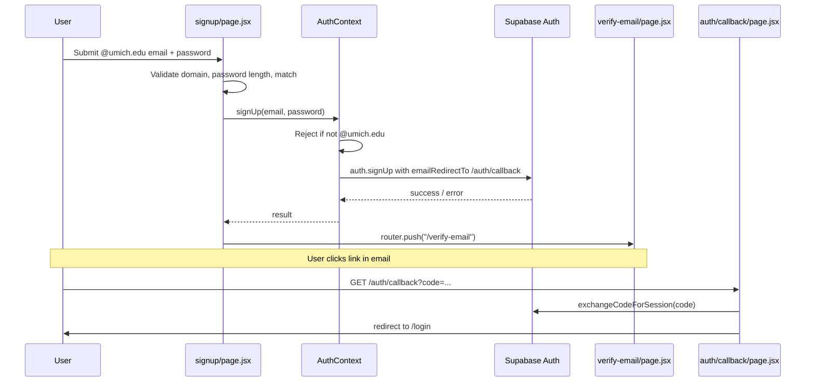
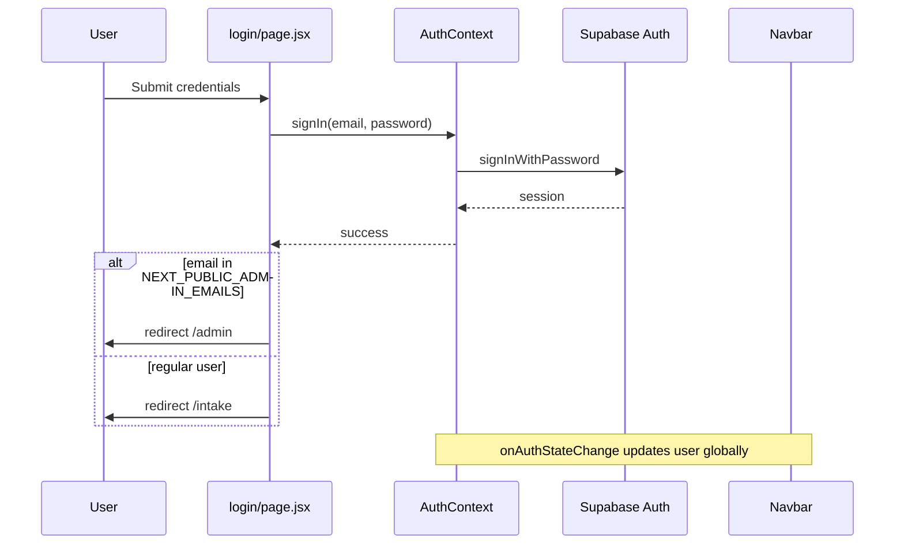
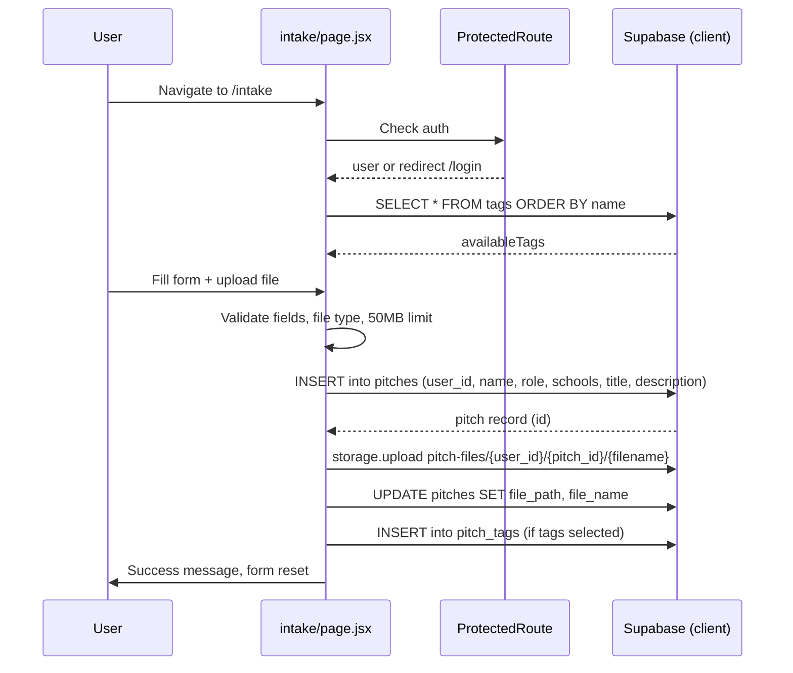
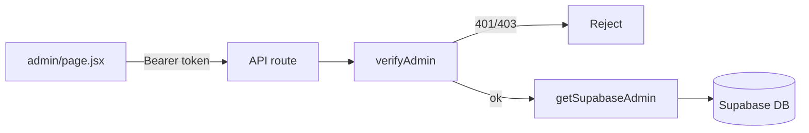

# 10KP — Technical Project Flow

This document describes the end-to-end flow of the **10KP** pitch submission platform, derived from a full review of every file in the repository.

---

## Table of Contents

1. [Overview](#overview)
2. [Tech Stack](#tech-stack)
3. [Repository File Map](#repository-file-map)
4. [Application Bootstrap Flow](#application-bootstrap-flow)
5. [Authentication Flow](#authentication-flow)
6. [Pitch Submission Flow](#pitch-submission-flow)
7. [Admin Flow](#admin-flow)
8. [API Routes](#api-routes)
9. [Database & Storage Schema](#database--storage-schema)
10. [Security Model](#security-model)
11. [Environment Configuration](#environment-configuration)
12. [Route & Navigation Map](#route--navigation-map)

---

## Overview

**10KP** is an online pitch submission platform for University of Michigan (`@umich.edu`) users. Participants sign up, verify their email, log in, and submit pitches with metadata, tags, and file attachments. Admins manage competition dates, review all submissions, and maintain the tag taxonomy.

The app is a **Next.js 14 App Router** application backed by **Supabase** (Auth, PostgreSQL, Storage).

---

## Tech Stack

| Layer | Technology |
|-------|------------|
| Framework | Next.js 14 (App Router) |
| UI | React 18, Tailwind CSS 3 |
| Backend / DB | Supabase (PostgreSQL, Auth, Storage) |
| Deployment | Vercel (preview deployments per branch) |

---

## Repository File Map

Every file in the project and its role:

### Root configuration

| File | Purpose |
|------|---------|
| `package.json` | Project metadata, scripts (`dev`, `build`, `start`, `lint`), dependencies (`next`, `react`, `@supabase/supabase-js`, `tailwindcss`) |
| `next.config.js` | Next.js config (currently empty defaults) |
| `middleware.js` | Placeholder middleware — no-op; route protection is client-side via `AuthContext` |
| `tailwind.config.js` | Tailwind content paths for `app/` and `components/` |
| `postcss.config.js` | PostCSS plugins: `tailwindcss`, `autoprefixer` |
| `.env.example` | Template for Supabase keys and admin email lists |
| `.gitignore` | Ignores `node_modules`, `.next`, `.env*.local`, etc. |
| `README.md` | Setup instructions and high-level project structure |
| `supabase-setup.sql` | SQL script to create tables, RLS policies, and storage bucket |

### `app/` — Pages and API routes

| File | Route / Endpoint | Purpose |
|------|------------------|---------|
| `app/layout.jsx` | (root layout) | Wraps all pages with `AuthProvider`, `Navbar`, global CSS |
| `app/globals.css` | — | Tailwind directives (`@tailwind base/components/utilities`) |
| `app/page.jsx` | `/` | Home page — displays "10KP Base" heading |
| `app/login/page.jsx` | `/login` | Login form; redirects admins → `/admin`, others → `/intake` |
| `app/signup/page.jsx` | `/signup` | Sign-up form with `@umich.edu` validation |
| `app/verify-email/page.jsx` | `/verify-email` | Post-signup prompt to check email |
| `app/auth/callback/page.jsx` | `/auth/callback` | Exchanges email verification code for session, redirects to `/login` |
| `app/intake/page.jsx` | `/intake` | Protected pitch submission form |
| `app/admin/page.jsx` | `/admin` | Admin dashboard (countdown, pitches table, tag management) |
| `app/api/admin/pitches/route.js` | `GET /api/admin/pitches` | Fetch all pitches with tags (admin only) |
| `app/api/admin/tags/route.js` | `GET/POST/DELETE /api/admin/tags` | List, create, delete tags (admin only) |
| `app/api/admin/competition-date/route.js` | `GET/PUT /api/admin/competition-date` | Read/set competition date |

### `components/` — Shared UI

| File | Purpose |
|------|---------|
| `components/Navbar.jsx` | Top navigation — logo, Gallery (disabled), Admin/Submit Pitch/Sign Out or Sign Up/Log In |
| `components/ProtectedRoute.jsx` | Client-side auth guard — redirects unauthenticated users to `/login` |

### `lib/` — Utilities and auth

| File | Purpose |
|------|---------|
| `lib/supabase.js` | Browser Supabase client (`supabase`) and server admin client (`getSupabaseAdmin`) |
| `lib/AuthContext.jsx` | React context: `user`, `loading`, `signUp`, `signIn`, `signOut` |
| `lib/adminAuth.js` | Server-side `verifyAdmin()` — validates Bearer token and checks `ADMIN_EMAILS` |

---

## Application Bootstrap Flow

```
Browser request
    │
    ▼
middleware.js          → no-op (matcher is empty)
    │
    ▼
app/layout.jsx
    ├── imports globals.css (Tailwind)
    ├── wraps app in <AuthProvider>
    │       └── lib/AuthContext.jsx
    │               ├── calls supabase.auth.getSession() on mount
    │               └── subscribes to onAuthStateChange
    ├── renders <Navbar />
    │       └── reads user from useAuth()
    └── renders <main>{children}</main>  → page component
```

**Entry point:** `app/layout.jsx` is the root shell. Every page inherits the navbar and auth state.

---

## Authentication Flow

### Sign-up



**Files involved:**
- `app/signup/page.jsx` — form validation (client)
- `lib/AuthContext.jsx` — `signUp()` enforces `@umich.edu`, sets redirect URL
- `app/verify-email/page.jsx` — static confirmation UI
- `app/auth/callback/page.jsx` — completes email verification

### Log-in



**Files involved:**
- `app/login/page.jsx` — form + role-based redirect
- `lib/AuthContext.jsx` — `signIn()`, session management
- `components/Navbar.jsx` — reflects logged-in state, shows Admin link for admins

### Sign-out

```
Navbar.handleSignOut()
    → AuthContext.signOut()
    → supabase.auth.signOut()
    → router.push("/")
```

### Route protection

| Page | Protection mechanism |
|------|---------------------|
| `/intake` | Wrapped in `<ProtectedRoute>` → redirects to `/login` if no user |
| `/admin` | Custom check in `admin/page.jsx` — redirects to `/` if not admin |
| `/login`, `/signup`, `/` | Public |

`middleware.js` does **not** enforce auth server-side. All protection is client-side.

---

## Pitch Submission Flow

**Page:** `app/intake/page.jsx` (protected)



### Form fields

| Field | Required | Storage |
|-------|----------|---------|
| Name | Yes | `pitches.name` |
| Role (student/staff/alumni) | Yes | `pitches.role` |
| U-M schools (multi-select) | No | `pitches.schools` (text array) |
| Pitch title | Yes | `pitches.title` |
| Description | Yes | `pitches.description` |
| Tags | No | `pitch_tags` join table |
| File | Yes | Supabase Storage `pitch-files` bucket |

### Accepted file types

PDF, Office docs (`.doc`, `.docx`, `.ppt`, `.pptx`), plain text, video (`.mp4`, `.mov`, `.webm`), images (`.png`, `.jpg`, `.gif`, `.webp`), audio (`.mp3`, `.wav`, `.ogg`, `.m4a`, `.aac`, `.weba`). Max size: **50 MB**.

### Storage path convention

```
pitch-files/{user_id}/{pitch_id}/{original_filename}
```

RLS ensures users can only read/write files under their own `user_id` folder.

---

## Admin Flow

**Page:** `app/admin/page.jsx`

Access requires:
1. Authenticated user (`useAuth`)
2. Email listed in `NEXT_PUBLIC_ADMIN_EMAILS`

Non-admins are redirected to `/`.

### Admin dashboard sections

| Section | Data source | Actions |
|---------|-------------|---------|
| Competition Countdown | `GET /api/admin/competition-date` | `PUT` to set/edit date via datetime-local input |
| All Pitches | `GET /api/admin/pitches` | Expand row to view description |
| Manage Tags | `GET /api/admin/tags` | `POST` new tag, `DELETE` by id |

### Admin API call pattern

```
admin/page.jsx
    → getToken() from supabase.auth.getSession()
    → fetch("/api/admin/...", { Authorization: Bearer <token> })
        → lib/adminAuth.js verifyAdmin()
            → validates JWT with Supabase
            → checks email against ADMIN_EMAILS
        → lib/supabase.js getSupabaseAdmin() (service role)
        → database operation bypassing RLS
```



---

## API Routes

### `GET /api/admin/pitches`

- **Auth:** Admin only
- **Returns:** All pitches with flattened `tags` array
- **Query:** Joins `pitches` → `pitch_tags` → `tags`, ordered by `created_at` DESC

### `GET /api/admin/tags`

- **Auth:** Admin only
- **Returns:** All tags ordered by name

### `POST /api/admin/tags`

- **Auth:** Admin only
- **Body:** `{ name: string }`
- **Returns:** Created tag (201) or 409 if duplicate name

### `DELETE /api/admin/tags?id={uuid}`

- **Auth:** Admin only
- **Returns:** `{ success: true }`

### `GET /api/admin/competition-date`

- **Auth:** None (uses service role directly)
- **Returns:** `{ competition_date: string | null }`

### `PUT /api/admin/competition-date`

- **Auth:** Admin only
- **Body:** `{ competition_date: ISO string }`
- **Behavior:** Upserts single row in `competition_settings`

---

## Database & Storage Schema

Defined in `supabase-setup.sql`.

### Tables

```
auth.users (Supabase managed)
    │
    └── pitches (user_id FK)
            ├── pitch_tags (pitch_id, tag_id) ── tags
            └── file_path → storage.objects in pitch-files bucket

competition_settings (single-row config)
```

### `tags`

| Column | Type |
|--------|------|
| id | uuid (PK) |
| name | text (unique) |
| created_at | timestamptz |

### `pitches`

| Column | Type |
|--------|------|
| id | uuid (PK) |
| user_id | uuid (FK → auth.users) |
| name | text |
| role | text |
| schools | text[] |
| title | text |
| description | text |
| file_path | text |
| file_name | text |
| created_at | timestamptz |

### `pitch_tags`

| Column | Type |
|--------|------|
| pitch_id | uuid (FK) |
| tag_id | uuid (FK) |
| PK | (pitch_id, tag_id) |

### `competition_settings`

| Column | Type |
|--------|------|
| id | uuid (PK) |
| competition_date | timestamptz |
| updated_at | timestamptz |

### Storage bucket: `pitch-files`

- Private bucket (`public: false`)
- Path pattern: `{user_id}/{pitch_id}/{filename}`
- RLS: users can upload/read only in their own `user_id` folder

---

## Security Model

### Client-side (anon key + user JWT)

- Users authenticate via Supabase Auth
- RLS on `pitches`, `pitch_tags`, `tags` (read), `competition_settings` (read)
- Users can only CRUD their own pitches and associated tags/files

### Server-side (service role key)

- Used only in API routes via `getSupabaseAdmin()`
- Bypasses RLS for admin operations (view all pitches, manage tags, set competition date)
- **Never exposed to the browser**

### Admin authorization

| Location | Env var | Usage |
|----------|---------|-------|
| Client (Navbar, login redirect, admin page guard) | `NEXT_PUBLIC_ADMIN_EMAILS` | UI visibility and redirects |
| Server (API routes) | `ADMIN_EMAILS` | `verifyAdmin()` authorization |

Both should list the same admin email addresses.

### Email domain restriction

Sign-up requires `@umich.edu` — enforced in both `signup/page.jsx` and `AuthContext.signUp()`.

---

## Environment Configuration

From `.env.example`:

| Variable | Scope | Purpose |
|----------|-------|---------|
| `NEXT_PUBLIC_SUPABASE_URL` | Public | Supabase project URL |
| `NEXT_PUBLIC_SUPABASE_ANON_KEY` | Public | Client-side Supabase key |
| `SUPABASE_SERVICE_ROLE_KEY` | Server only | Admin API database access |
| `ADMIN_EMAILS` | Server only | Admin authorization for API routes |
| `NEXT_PUBLIC_ADMIN_EMAILS` | Public | Admin UI checks in browser |

Optional (used by `AuthContext` for email redirect):
- `NEXT_PUBLIC_SITE_URL`
- `NEXT_PUBLIC_VERCEL_URL` (auto on Vercel)

---

## Route & Navigation Map

```
/                     Home (public)
├── /signup           Create account (public)
├── /verify-email     Post-signup confirmation (public)
├── /login            Log in (public)
├── /auth/callback    Email verification handler (public)
├── /intake           Submit pitch (authenticated)
└── /admin            Admin dashboard (admin only)

API (server):
├── GET    /api/admin/pitches
├── GET    /api/admin/tags
├── POST   /api/admin/tags
├── DELETE /api/admin/tags?id=
├── GET    /api/admin/competition-date
└── PUT    /api/admin/competition-date
```

### Navbar link visibility

| State | Links shown |
|-------|-------------|
| Not logged in | Gallery (disabled), Sign Up, Log In |
| Logged in (user) | Gallery (disabled), Submit Pitch, email, Sign Out |
| Logged in (admin) | Gallery (disabled), Admin, Submit Pitch, email, Sign Out |

---

## End-to-End User Journey Summary

```
1. User visits / → sees home page with Navbar
2. User signs up at /signup with @umich.edu email
3. User sees /verify-email → clicks link in email
4. /auth/callback verifies session → redirects to /login
5. User logs in → redirected to /intake (or /admin if admin)
6. User submits pitch at /intake:
      - metadata → pitches table
      - file → pitch-files storage
      - tags → pitch_tags table
7. Admin logs in → /admin dashboard:
      - sets competition date
      - views all pitches
      - creates/deletes tags (available on intake form)
```

---

## Known Gaps / Placeholders

| Item | Status |
|------|--------|
| `middleware.js` | No server-side route protection |
| Gallery nav button | Disabled, not implemented |
| Home page (`app/page.jsx`) | Placeholder "10KP Base" only |
| `GET /api/admin/competition-date` | No auth check (public read via service role) |

---
